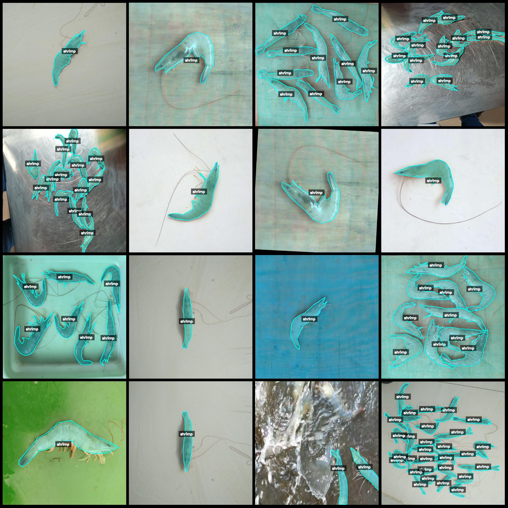
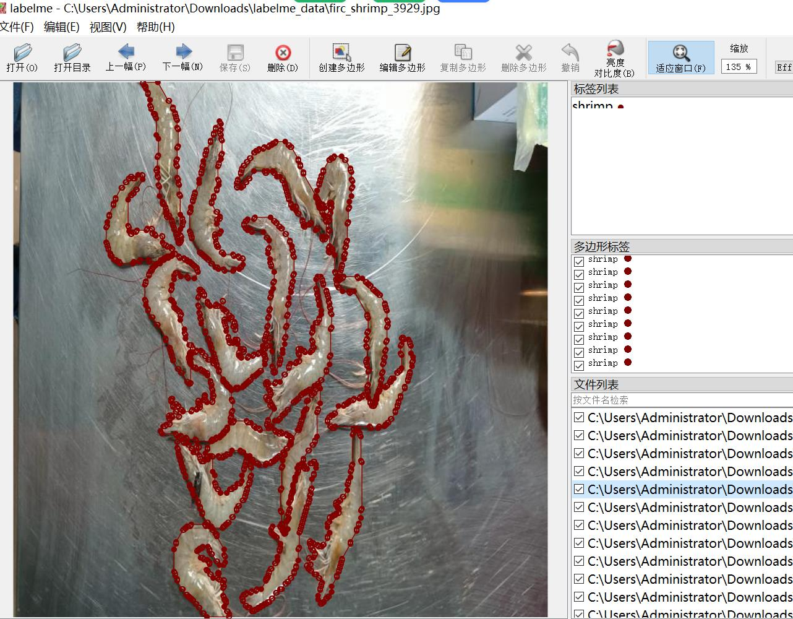

# Shrimp Identification and Counting Segmentation Dataset in LabelMe Format with 3360 Images in 2 Categories

Dataset Format: LabelMe format (excluding mask files, only containing JPG images and corresponding JSON files)
Number of Image Files: 3360
Number of Annotations: 3360
Number of Category Labels: 2
Category Label Names: ["area", "shrimp"]
Total Boxes Count: 18773

Using Annotation Tool: labelme = 5.5.0
Image Resolution: 640x640
Annotation Rules: Draw polygon boxes for categories
Special Note: This dataset can be edited using the labelme tool, but the JSON dataset needs to be converted into either Mask or Yolo or COCO format for semantic segmentation or instance segmentation

Special Remark: This dataset does not guarantee the accuracy of the trained models or weight files

Image Preview:
Annotation Example:
Randomly selected 16 image examples:
Annotation drawing results:
Labelme editing example image:

## Images

Here is a pay link on Stripe ( https://buy.stripe.com/3cs8yP7sY87d0vu9AB ). Please contact me lonlonago@foxmail.com after funding $89, and I will send you a complete data files , thank you!

